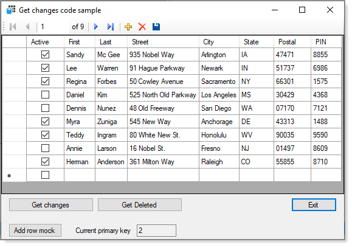

# About

Provides examples for obtaining changes to a DataTable using DataTable [GetChanges method](https://docs.microsoft.com/en-us/dotnet/api/system.data.datatable.getchanges?view=net-6.0) and DataTable events..

